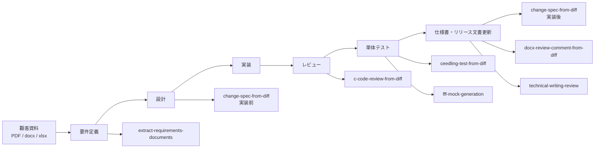

# embedded_skills

組み込み C/C++ 開発向けの Claude Code スキル集です。  
設計・コードレビュー・テスト・ドキュメント管理の各工程を自動化します。また、顧客資料（PDF・docx・xlsx）から要件定義書を生成するスキルも含みます。

---

## スキル一覧

| スキル | 工程 | 概要 |
| ------ | ---- | ---- |
| [`extract-requirements-documents`](skills/extract-requirements-documents/SKILL.md) | 要件定義 | 顧客から提供された PDF・docx・xlsx 資料から要件を抽出し、日本語の要件定義書（Markdown）を生成する |
| [`change-spec-from-diff`](skills/change-spec-from-diff/SKILL.md) | 設計 / 実装後 | issue・要件テキスト・git diff から変更仕様書（日本語 Markdown）を生成する |
| [`c-code-review-from-diff`](skills/c-code-review-from-diff/SKILL.md) | コードレビュー | git diff の変更箇所を組み込み観点＋一般品質観点でレビューし、重大度付きレポートを出力する |
| [`ceedling-test-from-diff`](skills/ceedling-test-from-diff/SKILL.md) | 単体テスト | git diff から Ceedling ユニットテスト（`test_*.c`）を生成・更新する |
| [`fff-mock-generation`](skills/fff-mock-generation/SKILL.md) | 単体テスト | git diff から FFF フェイク関数宣言（`FAKE_VOID_FUNC` / `FAKE_VALUE_FUNC`）を生成する |
| [`docx-review-comment-from-diff`](skills/docx-review-comment-from-diff/SKILL.md) | ドキュメント管理 | git diff をもとに既存 Word 仕様書（.docx）の修正が必要な箇所を特定し、レポートを出力する |
| [`technical-writing-review`](skills/technical-writing-review/SKILL.md) | ドキュメント管理 | 日本語技術文書を Google Technical Writing One の8カテゴリでレビューし、改善案付きレポートを出力する |

---

## スキルの対象工程



## ユースケース別マッピング

| ユースケース | 対象工程 | 使用するスキル | 入力 | 出力 |
| ------------ | -------- | -------------- | ---- | ---- |
| 顧客資料から要件を整理したい | 要件定義 | `extract-requirements-documents` | PDF / docx / xlsx | 要件定義書 |
| issue や口頭説明から実装前の変更仕様を作りたい | 設計 | `change-spec-from-diff` | issue / 要件テキスト / 口頭説明 | 変更仕様書 |
| 実装差分から変更内容を記録したい | 実装後記録 | `change-spec-from-diff` | `git diff` | 変更仕様書 |
| C/C++差分を組み込み観点でレビューしたい | コードレビュー | `c-code-review-from-diff` | `git diff` | 重大度付きコードレビューレポート |
| 変更関数のユニットテストを作りたい | 単体テスト | `ceedling-test-from-diff` | `git diff` / 既存 `test_*.c` | Ceedling テスト |
| 外部依存関数の FFF フェイクを作りたい | 単体テスト | `fff-mock-generation` | `git diff` / 関数呼び出し | `FAKE_VOID_FUNC` / `FAKE_VALUE_FUNC` 宣言 |
| コード変更に合わせて Word 仕様書の修正箇所を知りたい | ドキュメント管理 | `docx-review-comment-from-diff` | `.docx` / `git diff` | 仕様書修正指示レポート |
| 日本語技術文書の読みやすさを改善したい | 文書品質レビュー | `technical-writing-review` | Markdown / テキスト | 指摘と before/after 改善案 |

---

## インストール

各スキルの `SKILL.md` を Claude Code のスキルディレクトリにコピーします。

```bash
# 例: すべてのスキルをインストール
for skill in extract-requirements-documents change-spec-from-diff c-code-review-from-diff ceedling-test-from-diff fff-mock-generation docx-review-comment-from-diff technical-writing-review; do
  mkdir -p ~/.claude/skills/$skill
  cp skills/$skill/SKILL.md ~/.claude/skills/$skill/SKILL.md
done
```

インストール後、Claude Code を再起動するとスキルが認識されます。

---

## 各スキルの使い方

### `extract-requirements-documents`

```text
docs/rfq.pdf と specs/requirement.docx から要件定義書を作成してください
```

PDF・docx・xlsx からテキストを抽出し、機能要件・非機能要件・制約条件・前提条件に分類した要件定義書を `docs/requirements/` に出力します。

### `change-spec-from-diff`

```text
git diff HEAD~1 HEAD の変更仕様書を作成してください
```

issue・要件テキスト・git diff のいずれかを入力として受け付け、関数追加・インターフェース変更・動作変更などを分類し、要件（What/Why/What→What）・変更概要・シーケンス図・ファイル一覧をまとめた日本語 Markdown を `docs/changes/` に出力します。

### `c-code-review-from-diff`

```text
git diff HEAD~1 HEAD のコードレビューをしてください
```

以下の観点でレビューレポート（`docs/reviews/` 以下の Markdown）を生成します：

- **組み込み固有**: ISR 内の malloc・ブロッキング呼び出し、volatile 漏れ、HAL 境界違反、タイムアウトなし
- **一般品質**: 関数サイズ・ネスト深さ・戻り値未チェック・マジックナンバー

### `ceedling-test-from-diff`

```text
git diff の変更を確認してテストを作成してください
```

変更された C 関数を解析し、Unity + FFF を使った `test_<module>.c` を生成または更新します。

### `fff-mock-generation`

```text
git diff の変更に対して FFF フェイクを生成してください
```

外部関数呼び出しを検出し、`FAKE_VOID_FUNC` / `FAKE_VALUE_FUNC` 宣言と `setUp` の `RESET_FAKE` を生成します。

### `docx-review-comment-from-diff`

```text
git diff HEAD~1 HEAD の内容で docs/spec.docx のどこを修正すればよいか教えてください
```

python-docx または pandoc で docx を解析し、変更されたシンボルに対応する仕様書の章・段落を特定して修正指示レポートを `docs/docx-review/` に出力します。

### `technical-writing-review`

```text
technical-writing-reviewでREADME.mdをレビューしてください
```

日本語技術文書を8カテゴリで分析し、指摘箇所と改善案（before/after）を `docs/reviews/` 以下の Markdown として出力します。ファイルパスまたはテキストを直接入力として受け付けます。

---

## 推奨ワークフロー

スキルは独立して使えますが、以下の順序で組み合わせると効果的です。

### 要件定義〜設計フェーズ

```text
1. extract-requirements-documents   顧客資料 (PDF/docx/xlsx) から要件定義書を作成
2. change-spec-from-diff            要件をもとに実装前の変更仕様書を作成
```

### 実装・PR レビューフェーズ

```text
3. c-code-review-from-diff          組み込み観点のコードレビュー
4. ceedling-test-from-diff          変更関数のユニットテスト生成・更新
5. fff-mock-generation              必要なフェイク関数の宣言を生成
```

### リリース前・ドキュメント更新フェーズ

```text
6. change-spec-from-diff            git diff をもとに変更仕様書を確定
7. docx-review-comment-from-diff    既存 Word 仕様書の修正が必要な箇所を特定
8. technical-writing-review         リリース文書や仕様書の日本語品質を確認
```

---

## 動作環境

| ツール | 用途 | 必須 |
| ------ | ---- | ---- |
| [Claude Code](https://claude.ai/code) | スキルの実行環境 | 必須 |
| [Ceedling](https://github.com/ThrowTheSwitch/Ceedling) | `ceedling-test-from-diff` のテスト実行 | `ceedling-test-from-diff` 使用時 |
| [FFF](https://github.com/meekrosoft/fff) (`fff.h`) | フェイク関数フレームワーク | `fff-mock-generation` 使用時 |
| python-docx または pandoc | docx テキスト抽出 | `docx-review-comment-from-diff` / `extract-requirements-documents` 使用時 |
| pdftotext (poppler-utils) または pdfplumber | PDF テキスト抽出 | `extract-requirements-documents` 使用時 |
| openpyxl または pandas | xlsx テキスト抽出 | `extract-requirements-documents` 使用時 |

---

## ライセンス

[LICENSE](LICENSE) を参照してください。
