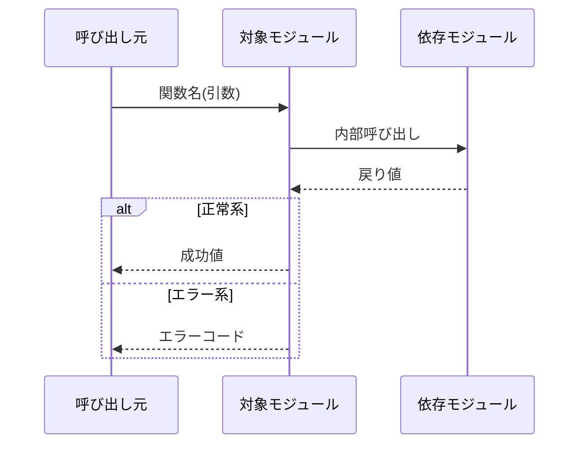

# 変更仕様書作成スキル

## 概要

入力の種類を問わず、統一フォーマットの変更仕様書（日本語 Markdown）を生成する。

| モード | 入力 | タイミング |
| ------ | ---- | ---------- |
| **設計フェーズ** | issue・要件テキスト・口頭説明 | 実装前 |
| **実装後** | `git diff` | 実装後の確認・記録 |
| **併用** | issue + diff | issueの意図と実装の整合確認 |

## 入力判定

呼び出し時に入力を確認し、モードを決定する。

いずれの入力もない場合は「変更内容を説明してください」とユーザーに確認する。

## ワークフロー

```text
入力判定 → 変更種別分類 → 要件抽出(What/Why/What→What) → 概要記述 → シーケンス図生成 → ファイル一覧生成 → Markdown出力
```

---

### Step 1: 入力を確認する

**設計フェーズの場合:**

- issue・要件テキストを読み込む
- 変更対象のモジュール・関数・定数を特定する（**What**）
- 変更の理由（**Why**）を文章から抽出する

> **入力検証:** What（変更対象）と Why（変更理由）の両方が揃わない場合は仕様書を生成せず、不足している情報をユーザーに確認する。例:
> - What は判明しているが Why が不明 → 「この変更が必要な背景・目的を教えてください」
> - Why は判明しているが変更対象が特定できない → 「どのモジュール・関数・定数を変更しますか？」

**実装後の場合:**

```bash
git diff HEAD~1 HEAD       # または指定された ref
git log -1 --format="%H %an %ad %s" --date=short
git branch --show-current

# 他の一般的な ref
git diff <tag>..HEAD          # リリースタグ以降
git diff origin/main...HEAD   # ブランチの全変更
```

**併用の場合:**

- issue と diff の両方を読み込む
- issueの意図と実装の差異があれば「変更概要」セクションに注記する

---

### Step 2: 変更種別を判定する

| パターン | 変更種別 |
| -------- | -------- |
| 関数を新規追加する | 新機能 |
| 関数のシグネチャ（引数・戻り値）を変更する | インターフェース変更 |
| 関数の内部ロジックを変更する（シグネチャ不変） | 動作変更 |
| 関数を削除する | 機能削除 |
| `#define` の値を変更する | 定数変更 |
| ファイルを新規追加する | モジュール追加 |
| ファイルを削除する | モジュール削除 |

複数の変更種別が混在する場合は、最も影響範囲が大きいものをタイトルに使用し、詳細セクションで個別に記述する。

#### セマンティックバージョニングへの対応

変更種別が決まったら、リリースバージョン番号への影響を以下のテーブルで判定し、仕様書の「変更概要」セクションに記載する：

| 変更種別 | SemVer 影響 | 理由 |
| -------- | ----------- | ---- |
| 新機能（関数追加） | **MINOR** ↑ | 後方互換を保ちながら機能追加 |
| インターフェース変更 | **MAJOR** ↑ | 呼び出し元の修正が必要（後方非互換） |
| 動作変更（バグ修正） | **PATCH** ↑ | 外部仕様は変わらず内部修正のみ |
| 動作変更（仕様変更） | **MINOR** ↑ | 意図的な挙動変更だが後方互換あり |
| 機能削除 | **MAJOR** ↑ | 後方非互換 |
| 定数変更（公開API影響あり） | **MAJOR** ↑ | 呼び出し元の期待値が変わる |
| 定数変更（内部のみ） | **PATCH** ↑ | 外部から見えない変更 |
| モジュール追加 | **MINOR** ↑ | 後方互換を保ちながら機能追加 |
| モジュール削除 | **MAJOR** ↑ | 後方非互換 |

SemVer が適用されないプロジェクト（組み込みファームウェア等）では、この判定を「破壊的変更あり / なし」の区別に読み替える。

---

### Step 3: 要件を抽出する

以下の3項目を必ず埋める。不明な場合は空欄にせず `要確認` と記載する。

| 項目 | 設計フェーズ | 実装後 |
| ---- | ------------ | ------ |
| **What（変更対象）** | issue・要件から特定 | diff のシンボルから特定 |
| **Why（変更理由）** | issue の背景・目的から取得 | コミットメッセージ・ブランチ名から推測。不明なら `要確認` |
| **What→What（変更前後）** | 現状仕様 → 望む仕様を記述 | diff の変更前後から生成 |

---

### Step 4: シーケンス図を生成する

Mermaid 記法で記述する。

**設計フェーズ（提案）:** 想定する処理フローを記述する。



**実装後（diff から生成）:** 実際のコードフローを反映する。主要パスを記述し、エラーパスは alt ブロックで追加する。

シーケンス図が不適切な場合（定数変更のみ、ファイル追加のみなど）は省略し `該当なし` と記載する。

---

### Step 5: ファイル一覧を生成する

**設計フェーズ（予定）:** 変更が予想されるファイルを列挙し「予定」と明記する。

**実装後（確定）:**

```bash
git diff --name-status HEAD~1 HEAD
```

変更種別コード: `A`=追加, `M`=修正, `D`=削除

---

### Step 6: 仕様書を出力する

## 出力テンプレート

```markdown
# [変更種別] モジュール名: 変更内容の一文概要

> **作成日:** YYYY-MM-DD
> **作成モード:** 設計フェーズ / 実装後 / 併用
> **参照:** issue #N / コミット abc1234 / ブランチ feature/xxx

---

## 要件

**What（変更対象）:**
〈変更対象の関数・定数・モジュールを具体的に記述〉

**Why（変更理由）:**
〈なぜこの変更が必要か。不明な場合は「要確認」と記載〉

**What → What（変更前後）:**

| | 変更前 | 変更後 |
| --- | ------ | ------ |
| 〈シグネチャ / 動作 / 値など〉 | 〈変更前〉 | 〈変更後〉 |

---

## 変更概要

〈どのように変更するかを 1〜3 文で記述〉

### 影響分析
- **メモリ影響 (Stack/Heap/Static):** なし / あり（内容： ）
- **タイミング影響 (ISR/Blocking):** なし / あり（内容： ）
- **周辺機能/HAL影響:** なし / あり（内容： ）

> ⚠️ **破壊的変更あり:** 〈影響を受ける呼び出し元・対応方法〉

または

> ✅ **破壊的変更なし**

---

## 変更詳細

### 検証ステータス
- [ ] **ユニットテスト:** 未実施 / パス（ファイル： ）
- [ ] **静的解析/レビュー:** 未実施 / 実施済み
- [ ] **実機確認:** 未実施 / 実施済み（証跡： ）

### シーケンス図

```mermaid
sequenceDiagram
    ...
```

### 追加/修正するファイル

| ファイル | 変更種別 | 変更内容 |
| -------- | -------- | -------- |
| `src/xxx.c` | 修正（予定）または 修正（確定） | 〈変更内容〉 |
| `include/xxx.h` | 修正（予定）または 修正（確定） | 〈変更内容〉 |
| `test/test_xxx.c` | 修正要 | 〈更新が必要な理由〉 |
```


複数モジュールにわたる変更は、モジュールごとに「変更詳細」セクションを繰り返す。

## 出力ファイル

`docs/changes/YYYY-MM-DD-<モジュール名>-change-spec.md` に保存する。リポジトリルート（`.git/` が存在するディレクトリ）からの相対パス。

```bash
mkdir -p docs/changes
```

---

### 最終ステップ: フィードバック収集

スキルの実行が完了しました。以下の点で問題はありましたか？

- **出力品質**: 見落とし・誤りがあった、期待と異なる結果になった
- **使い勝手**: 入力の渡し方が分かりにくい、出力フォーマットが使いにくい

**問題があった場合:** 具体的に説明してください。このSKILL.mdを改善してコミットします。  
**問題がなかった場合:** このステップはスキップしてください。
